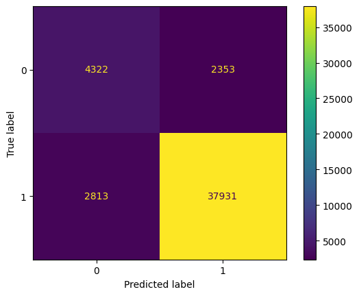
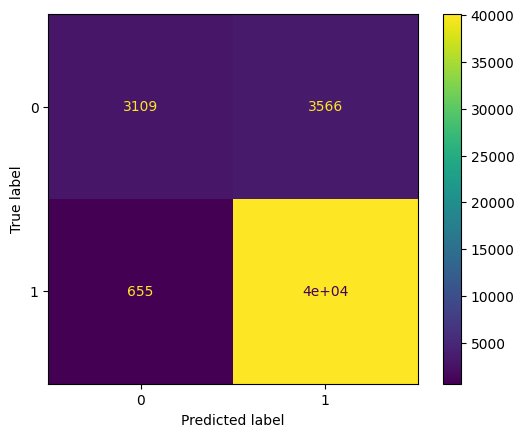
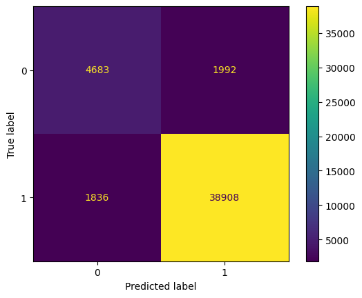
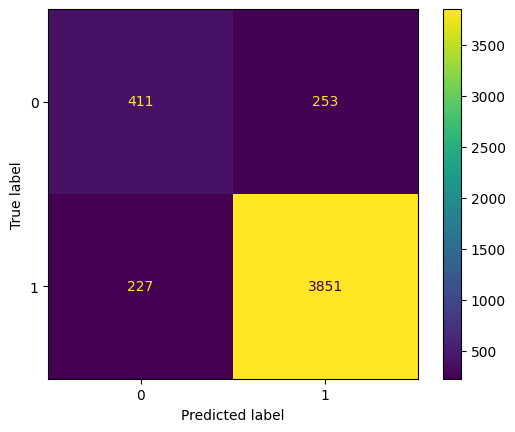
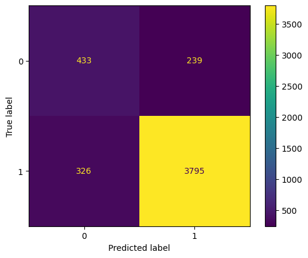
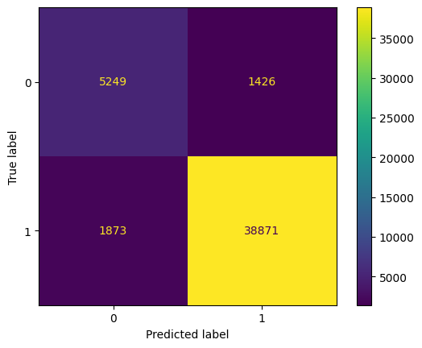

# Улучшение результатов baseline'а
Для улучшения результатов были проведены эксперементы со следующими моделями:
- [`DecisionTreeClassifier`](#decisiontreeclassifier)
- [`RandomForestClassifier`](#randomforestclassifier)
- [`CatBoost`](#catboost)
- [`Ансамбли`](#ансамбли)

Лучшими конфигурациями оказались:
- [`CatBoost и baseline`](#catboost-и-baseline)
- [`CatBoost с новым признаком`](#catboost-с-новым-признаком) — аналогично предыдущему, но весит в 1.5 раза меньше

Они уверенно побеждают baseline в точности предсказания отрицательных отзывов, но ошибаются незначительно чаще.
# Baseline
Напоманием результаты baseline'а (стемминг + tf-tdf + логистическая регрессия с подбором гиперпараметров):
- Негативные — `Precision`=0.79, `Recall`=0.70, `F1`=0.74
- Позитивные — `Precision`=0.95, `Recall`=0.97, `F1`=0.96
- `Accuracy` — 0.93

Использовался датасет **WB**, эксперементы проводим на тех же данных.
# DecisionTreeClassifier
Перебирались только веса классов для компенсации дисбаланса, в итоге лучшим соотношением оказалось 2:1.\
Результат:
- Негативные — `Precision`=0.61(-0.18), `Recall`=0.65(-0.05), `F1`=0.63(-0.11)
- Позитивные — `Precision`=0.94(-0.01), `Recall`=0.93(-0.04), `F1`=0.94(-0.02)
- `Accuracy` — 0.89(-0.04)

# RandomForestClassifier
Обучался с фиксированным количеством `n_estimators`, а именно 50.\
Результат:
- Негативные — `Precision`=0.83(+0.04), `Recall`=0.47(-0.23), `F1`=0.63(-0.11)
- Позитивные — `Precision`=0.92(-0.03), `Recall`=0.98(+0.01), `F1`=0.94(-0.02)
- `Accuracy` — 0.91(-0.02)

# CatBoost
Для каждой конфигурации подбирался оптимальный `threshold` для борьбы с дисбалансом классов.
## На всём датасете, без подбора гиперпараметров
Лучший результат с `threshold`=0.25:
- Негативные — `Precision`=0.72(-0.07), `Recall`=0.70(=), `F1`=0.71(-0.03)
- Позитивные — `Precision`=0.95(=), `Recall`=0.95(-0.02), `F1`=0.95(-0.01)
- `Accuracy` — 0.92(-0.01)

## 10% от датасета
Эксперементы в данной секции проводились на сабсете данных, чтобы решить проблему с долгим обучением моделей.
### Подбор гиперпараметров
Оптимальные значения параметров, подбирались на 3-х фолдах:
- `max_features`=5000 (tf-idf)
- `learning_rate`=0.05
- `depth`=8
- `l2_leaf_reg`=3

Полученные результаты с `threshold`=0.3:
- Негативные — `Precision`=0.64(-0.15), `Recall`=0.62(-0.08), `F1`=0.63(-0.11)
- Позитивные — `Precision`=0.94(-0.01), `Recall`=0.97(-0.03), `F1`=0.94(-0.02)
- `Accuracy` — 0.90(-0.03)

### Эмбеддинги rubert-tiny2
Результаты с `threshold`=0.35:
- Негативные — `Precision`=0.57(-0.22), `Recall`=0.64(-0.06), `F1`=0.61(-0.13)
- Позитивные — `Precision`=0.94(-0.01), `Recall`=0.92(-0.05), `F1`=0.93(-0.03)
- `Accuracy` — 0.88(-0.05)

# Ансамбли
## CatBoost и baseline
Попробуем сделать ансамбль из CatBoost'а, обученного на всём датасете, и нашего baseline'а.\
В данном случае подбор `threshold` уже не меняет ситуацию, но надо подбирать веса для полученных от моделей вероятностей.\
Оптимальными весами оказались $[0.58, 0.42]$, но в случае чего эти параметры можно менять «на ходу».\
Результат:
- Негативные — `Precision`=0.74(-0.05), `Recall`=0.79(+0.09), `F1`=0.76(+0.02)
- Позитивные — `Precision`=0.96(+0.01), `Recall`=0.95(-0.02), `F1`=0.96(=)
- `Accuracy` — 0.93(=)

## CatBoost с новым признаком
Попробуем добавить новый признак — вероятность от baseline'a.\
Результат с `threshold`=0.3:
- Негативные — `Precision`=0.74(-0.05), `Recall`=0.77(+0.07), `F1`=0.76(+0.02)
- Позитивные — `Precision`=0.96(+0.01), `Recall`=0.96(-0.01), `F1`=0.96(=)
- `Accuracy` — 0.93(=)

