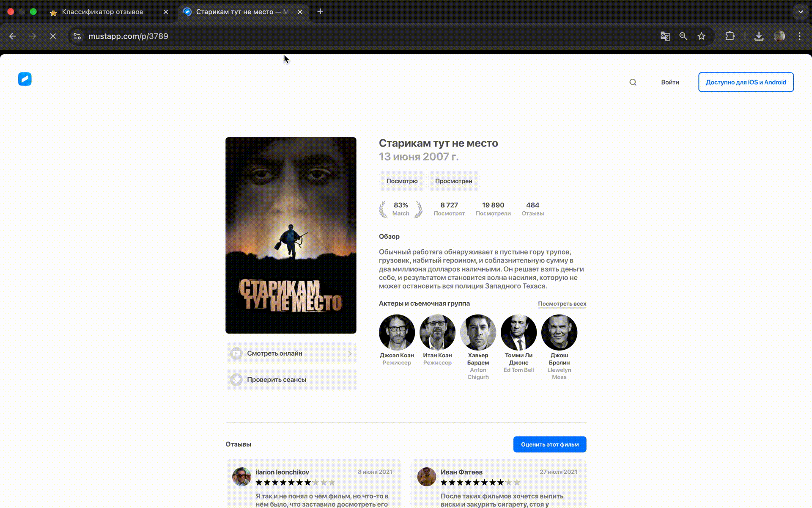
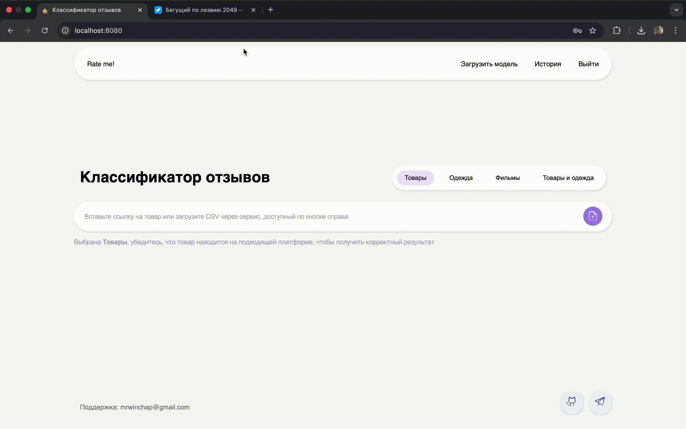

# Ответы на вопросы для отчётности
Здесь вы найдёте ответы на заданные в требованиях вопросы:
- Как необходимо пользоваться вашей системой?
- Как билдить докер-образ и запускать контейнер?
- Как пользоваться всеми реализованными функциями?
- Как деплоили проект?
## Докер-образы и запуск контейнера
Всё приложение включается в себя:
- Backend (FastAPI)
- Streamlit-интерфейс
- Веб-сайт
- Postgres-базу данных

Сначала обсудим в общих чертах как собирать образ каждой сущности отдельно, а после успростим процесс при помощи docker-compose.
### Отдельно
Этот способ разумно использовать, если вы хотите каждую сущность поселить на отдельном vps сервере.  
Для всех сущностей нужно заполнить `.env` файлы по заданным шаблонам, которые можно найти в соответствующих директориях (для вебсайта это будет не `.env`, а `config.js`).  
Для локальной проверки достаточно указать localhost с нужными портами, но не забывайте, что в правильном `.env` файле бэкенда должны быть ключи для доступа к Yandex Storage.  
Далее, если вы действительно собрались конфигурировать весь проект вручную через создание всех образов отдельно, то есть без использования docker-compose, используйте следующую команду для каждой сущности, находясь в нужной директории:
```
docker build -t image-name .
```
Запуск контейнера осуществляется следующим образом, если нужно, указывайте дополнительные параметры самостоятельно (например, для постоянного рестарта после перезагрузки и т.д.):
```
docker run -d image-name
```
Обратите внимание, что образ для базы данных postgres уже есть на официальном docker hub, подтягивающий его docker-compose лежит в директории `service/backend/database`, наслаждайтесь! Вам остаётся лишь не забыть прогнать скрипт для инициализации базы данных из той же директории:
```
cat database.pgsql | docker exec -i postgres_reviews psql -U postgres -d reviews_db
```
### Единое создание и запуск
В директории `service` лежит docker-compose, который упрощает конфигурирование всех зависимостей между сущностями, а именно — вам не придётся после заполнения `.env` и `config.js` билдить все образы отдельно, потому что docker-compose всё сам соберёт и запустит, даже проверит работоспособность некоторых служб самостоятельно.  
Обратите внимание, что в параметре `env_file` всё ещё указаны пути репозитория, а значит снова нужно бегать по соответствующим сущностям директориям.  
В таком случае ваши лучшие друзья:
```
docker-compose build
docker-compose up -d
```
### Альтернатива попроще (удобно для локального деплоя)
На нашем docker hub уже лежит три готовых актуальных образа, подтянуть их можно при помощи docker-compose в директории `service/compose-from-docker-hub`.  
Обратите внимание, что теперь файлы конфигурации ожидаются в той же директории, что удобно.  
Главное помните, когда нужно указывать localhost, когда имя службы из docker-compose, а когда внешний адрес сервиса :)  
Команды те же, что и в предыдущем разделе.
## Инструкция по использованию системы
Проект предусматривает начало всех взаимодействий через сайт, но при желании можно сразу пользоваться основыми функциями через streamlit в качестве гостя, но стоит отметить, что загрузка модели, история запросов, вход/регистрация, предсказание по ссылке на контент доступны только через наш сайт.  
Как говорится, на практике всё становится понятнее, давайте рассмотрим базовые сценарии использования — это будет самая понятная инструкция!
### Функционал без регистрации
#### Предсказание меток для отзывов в csv
Предсказание csv -> скачивание результата

#### Предсказание меток для отзывов на контект по ссылке

### Функционал с аккаунтом
#### История
Регистрация -> вход -> предсказание по ссылке на контект -> предсказание csv -> просмотр ранее полученных результатов через историю.

#### Загрузка готовой модели
Загрузка pkl -> предсказание по ссылке в исполнении пользовательской модели.

#### Загрузка данных для обучения модели
Загрузка данных для обучения модели -> предсказание по ссылке в исполнении пользовательской модели -> предсказание csv в исполнении пользовательской модели (загруженной в предыдущей gif'ке) -> просмотр истории.  
Обратите внимание, что на сайте отображается последняя загруженная модель пользователя, а в streamlit можно выбрать любую из ранее загруженных.

#### Использование результата в качестве входных данных для другой модели
Скачивание ранее полученных результатов через историю -> скаченный файл подаётся на вход новой модели.

## Описание деплоя
Начнём с простого, база данных была развёрнута через [render](https://render.com/), чтобы не занимать лишние ресурсы будущей VPS'ки. После создания было произведено подключение через psql для последующего запуска скрипта инициации (database.pgsql).  
[Здесь](https://billing.firstbyte.ru/) была арендована VPS'ка, на которой позже будут развёрнуты:
- API
- Streamlit
- Сайт

Предварительно, по инструкции выше, были созданы отдельные докер образы и выгружены в Docker Hub.  
Сразу после аренды и подключения по ssh была обновлена система и скачены актуальные пакеты (в том числе git, docker).  
Далее были подтянуты образы с Docker Hub, настроены `.env` и `config.js` для последующего разворачивания контейнеров.  
Таких манипуляций вполне хватило, чтобы получить рабочий сервис, доступный в сети интернет.